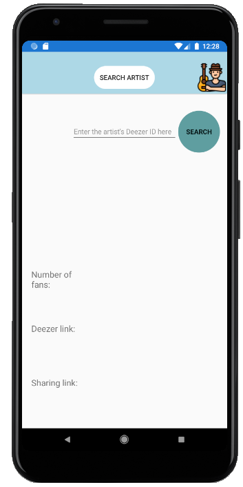
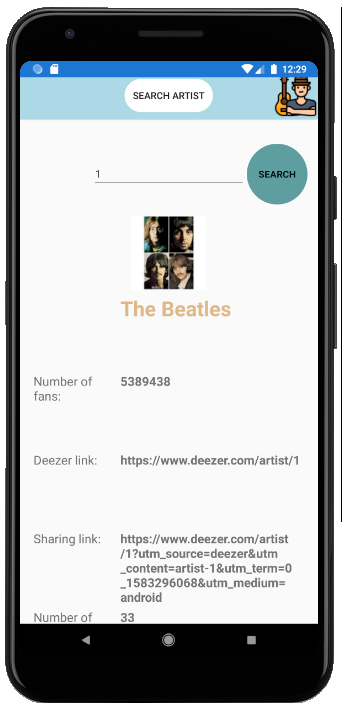
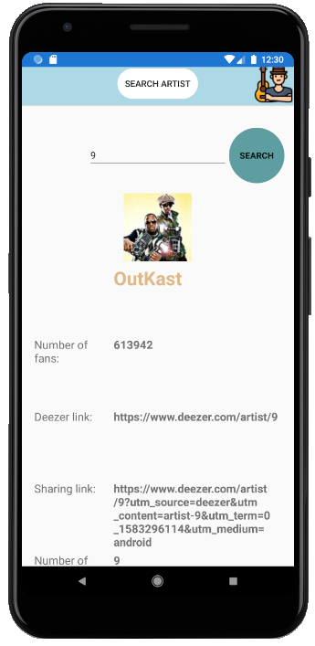

# DeezerApiSample

DeezerApiSample is a sample application that retrieves data from Deezer API allowing you to search an artist by it's Deezer ID and finally displaying its info on screen.

- Used API: (https://rapidapi.com/deezerdevs/api/deezer-1)
- Used EndPoint: (https://deezerdevs-deezer.p.rapidapi.com/artist/{ArtistID})

<h2 style="text-align: center;"><strong>Main screen</strong></h2>

  

<h2 style="text-align: center;"><strong>First search</strong></h2>

 

  
<h2 style="text-align: center;"><strong>Second search</strong></h2>

